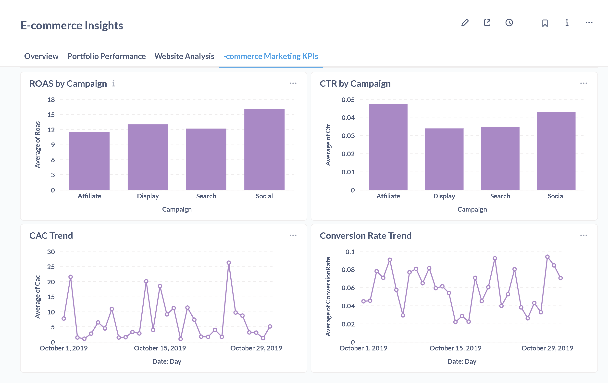

# Growth Marketing Analytics Dashboard with ClickHouse & Metabase
SQL on ClickHouse + actionable dashboards in Metabase + business insights

## 🎯 Project Overview

This project demonstrates a production-ready marketing analytics stack that can handle high-volume marketing data with real-time insights and interactive dashboards.

## 🏗️ Architecture

- **ClickHouse**: High-performance analytical database for marketing data
- **Metabase**: Business intelligence and visualization platform
- **Docker Compose**: Container orchestration for easy deployment

## 🧪 Data Exploration & Preparation

The project uses the [E-Commerce Behavior Data from Multi-Category Store](https://www.kaggle.com/datasets/mkechinov/ecommerce-behavior-data-from-multi-category-store)
as a base dataset, extended with simulated marketing metrics to calculate KPIs such as CTR, Conversion Rate, CAC, and ROAS.

- Notebook: [`notebooks/EDA.ipynb`](notebooks/EDA.ipynb)
- Processed dataset: [`data/marketing_kpis.csv`](data/marketing_kpis.csv)

📊 The dataset includes realistic marketing variables:
- Campaign types: Search, Display, Social, Affiliate
- AdSpend, Impressions, Clicks, Conversions, Revenue
- Derived KPIs: CTR, Conversion Rate, CPC, CAC, ROAS

## 📊 Marketing KPI Dashboard (Metabase + ClickHouse)

- Data: `data/marketing_kpis.csv` (simulated marketing metrics over real e-commerce behavior)
- Database: ClickHouse (Docker)
- BI: Metabase

**Highlights**
- ROAS by Campaign
- CTR by Campaign
- CAC Trend (daily)
- Conversion Rate Trend (daily)

  

## 🤝 Contributing

This project serves as a portfolio showcase. For suggestions or improvements:
1. Fork the repository
2. Create a feature branch
3. Submit a pull request

## 📞 Contact

**Zohreh Rezaei**
- GitHub: [@zohrehrezaei-dev](https://github.com/zohrehrezaei-dev)
- Email: [zohrehrezaei-dev@gmail.com]

## 📄 License

This project is part of a data analyst portfolio showcase.

---

*Built with ❤️ for data-driven marketing insights*

